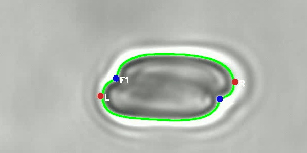
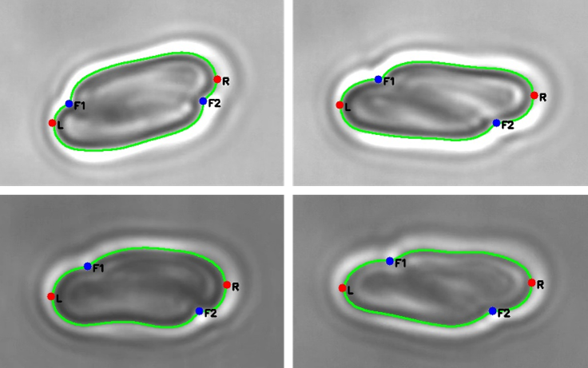

# Keypoint Extraction and Critical Frame Identification for Optical Tweezers Videos

This repository provides an automatic critical frame identification pipeline for optical tweezers-based cell mechanics videos. The pipeline integrates YOLOv5-based cell localization, Cellpose-SAM-based contour segmentation, geometric keypoint extraction, and displacement-based critical frame identification.

The program reads an input video frame by frame, detects the target cell region, extracts keypoints from the segmented cell contour, calculates keypoint displacement across frames, and identifies the first frame with significant keypoint fluctuation as the critical frame.
The following animation illustrates the frame-by-frame cell contour detection, keypoint extraction process.


## Features

- Frame-by-frame video processing
- YOLOv5-based cell region detection
- Cellpose-SAM-based cell contour segmentation
- Endpoint and concave-point-based keypoint extraction
- Adaptive threshold calculation based on cell contour geometry
- Inter-frame keypoint displacement analysis
- Automatic saving of processed frames, original frames, key frames, and log files


## Requirements

The code is recommended to run with Python 3.9.

Install the required packages with:

```bash
pip install -r requirements.txt
```

The recommended `requirements.txt` is:

```text
opencv-python>=4.8.0
numpy>=1.23.0
scipy>=1.10.0
torch>=2.0.0
torchvision>=0.15.0
cellpose>=3.0.0
matplotlib>=3.7.0
Pillow>=9.0.0
PyYAML>=6.0
requests>=2.28.0
tqdm>=4.64.0
pandas>=1.5.0
seaborn>=0.12.0
psutil>=5.9.0
thop>=0.1.1
```

If GPU acceleration is required, please install the PyTorch version compatible with your CUDA version.

## Model Weights

Due to file size limitations, the Cellpose-SAM model weights are not included directly in this repository. The YOLOv5 detection weight file has already been provided in the `weights/` directory, while the Cellpose-SAM weight file is provided through GitHub Releases.
Please download the Cellpose-SAM weight file from the following link:
https://github.com/18010911651-yue/Keypoint-Extraction-and-Critical-Frame-Identification-for-Optical-Tweezers-Videos/releases/download/v1.0.0/cellpose-sam.zip

After downloading, unzip the file and place it in the `weights/` directory. The expected directory structure is:

```text
weights/
├── yolov5_best.pt
└── cellpose-sam

## YOLOv5 Source Files

This code depends on local YOLOv5 source files, including:

```python
from models.experimental import attempt_load
from utils.general import non_max_suppression
```

Therefore, the `models/` and `utils/` folders from YOLOv5 should be included in the project directory.

## Example Video

Since the full dataset is associated with ongoing academic research and experimental data management requirements, only a short demo video is provided in this repository for testing and reproducibility of the basic workflow.
The default input video path is:

```python
video_path = "example/demo.avi"
```
Some example frames from the processed video is shown below.


## Usage

Run the program with:

```bash
python main.py
```

## Output Files

After running the program, the results will be saved in the `outputs/` directory:

```text
outputs/
│
├── frame_*.jpg
├── original_frames/
├── key_frames/
└── four_points_log.txt
```

The output files include:

| Output | Description |
|---|---|
| `frame_*.jpg` | Processed frames with detected contours, keypoints, and displacement information |
| `original_frames/` | Original frames extracted from the input video |
| `key_frames/` | Identified critical frame images |
| `four_points_log.txt` | Frame-level keypoint coordinates, displacement values, threshold values, ROI matching status, and key-frame judgment results |


## Main Parameters

| Parameter | Description |
|---|---|
| `video_path` | Path of the input video |
| `model_path` | Path of the YOLOv5 detection model |
| `save_dir` | Directory for saving output results |
| `step` | Step size used for concave point detection |
| `concave_angle_thresh` | Angle threshold for concave point detection |
| `save_key_frames_separately` | Whether to save detected key frames separately |
| `iou_match_thresh` | IOU threshold for matching ROIs between frames |
| `max_backtrack_frames` | Number of historical frames used for backtracking comparison |

## Notes

1. The input video should be placed in the `example/` folder or specified by modifying `video_path` in `main.py`.
2. The YOLOv5 model weight should be placed at `weights/yolov5_best.pt`.
3. The Cellpose-SAM model should be placed at `weights/cellpose-sam`.
4. The YOLOv5 source folders `models/` and `utils/` should be included in the project directory.

## Citation

If this code is used in academic work, please cite the corresponding paper or project.
